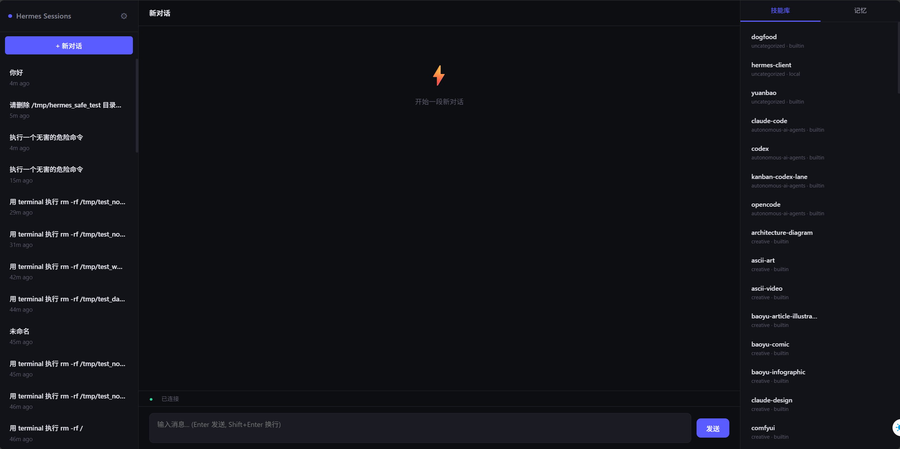

[English](README.md) | [简体中文](README_zh.md)

# Wermes Client

> 为 [Hermes Agent](https://github.com/nousresearch/hermes-agent) 构建的本地 Web 客户端 —— 三栏布局、SSE 流式工具调用、会话管理、危险命令确认。

## 截图



## Why？

当我每天打开hermes CLI时我都要开个新会话然后跟他说：“你好deepseek，我想回到昨天的对话”，然后他给我回到了前天的对话(ˉ▽ˉ；)...，就算是手动调出会话list，我也要鼠标->复制->hermes --resume xxxxxx，我的天啊！兄弟！

## 功能

- **三栏 Web UI** — 会话列表 / 聊天区 / 技能记忆面板，Linear 暗色风格
- **SSE 流式工具调用** — 实时展示 agent 执行的每个工具（`🔍 search_files → 📖 read_file → 💻 terminal`）
- **会话管理** — 浏览历史、删除、右键查看详情（Token / 费用 / 模型）、非阻塞切换
- **会话续接** — 基于 `hermes chat -q --resume`，多轮对话保留在同一会话
- **危险命令确认** — 检测 hermes 拦截的危险命令，弹窗确认后 `--yolo` 重跑（这个我在改了TT）
- **中英双语** — 设置中一键切换 UI 语言
- **零外部依赖的前端** — 单文件 SPA，无 npm / webpack
- **Web开销压缩** — 基于SQLite进行信息保存，在hermes CLI基础上耗时最多仅增10%

## 快速开始

当然你也可以直接跟hermes说：“兄弟，你去运行一下run.py”，然后让他把这个过程设置为一项技能即可

```bash
# 1. 安装依赖
pip install fastapi uvicorn pydantic

# 2. 启动
python run.py
# → http://127.0.0.1:7861
```

> 需要已安装并配置好 [Hermes Agent](https://github.com/nousresearch/hermes-agent)。

## 项目结构

```
wermes-client/
├── run.py              # 一键启动入口
├── server.py           # FastAPI 后端（SSE + SQLite 轮询）
├── requirements.txt    # Python 依赖
├── static/
│   ├── index.html      # 前端 SPA（单文件，无框架）
│   └── starfield.html  # 彩蛋：星空粒子动画
└── .gitignore
```

## 架构

```
浏览器 ──SSE──→ FastAPI ──subprocess──→ hermes -z "msg"          ← 新建会话
                                    └──→ hermes chat -q "msg"    ← 续接会话
                                              --resume <sid> --quiet
```

**SSE 事件流：**

| 事件 | 时机 | 说明 |
|------|------|------|
| `session` | 会话 ID 确定 | 前端更新当前会话 |
| `tool` | 进程运行中轮询（0.3s） | 实时展示工具调用 + 完整命令 |
| `danger` | 检测到危险命令被拒 | 弹出确认对话框 |
| `response` | 进程结束 | 最终回复 |
| `done` | 流结束 | 清理状态 |

**双模式：**

| 模式 | CLI 命令 | 说明 |
|------|---------|------|
| 新建 | `hermes -z "msg"` | 创建新会话 |
| 续接 | `hermes chat -q "msg" --resume <sid> --quiet` | 在已有会话中追加 |

## API

| 端点 | 方法 | 功能 |
|------|------|------|
| `/api/sessions` | GET | 会话列表 |
| `/api/sessions/{id}` | GET / DELETE | 会话消息 / 删除 |
| `/api/sessions/{id}/info` | GET | 会话元数据（模型/Token/费用） |
| `/api/chat/stream` | POST | 核心：SSE 流式聊天 |
| `/api/chat/retry` | POST | 危险命令批准后 `--yolo` 重跑 |
| `/api/skills` | GET | 技能列表 |
| `/api/skills/{name}` | GET | 技能详情 |
| `/api/memory` | GET | 记忆数据 |

## 技术栈

- **后端**: Python / FastAPI / SSE / SQLite
- **前端**: 原生 JS / 单文件 SPA / CSS Variables
- **CLI 集成**: Hermes Agent subprocess + SQLite 直读轮询

## BUG & 提醒

目前是v1.0版本，很多bug，比如交互信息显示功能，由于是Web的client所以不能像CLI那样每一步都能详尽的展示出来，再加上因为SQL的轮询查看机制会导致耗时增加（加的是10%左右），我的妈啊兄弟，Web真的不好用TT

还有这是我第一次发这种这么正式的github仓库，我我我真的不知道写什么啊😰😰😰

## 未来

我打算将这个Web转换到MCP客户端上，采用用户输入->底层CLI->会话输出的机制，仅有IO开销保证性能最大化。

## License

MIT
